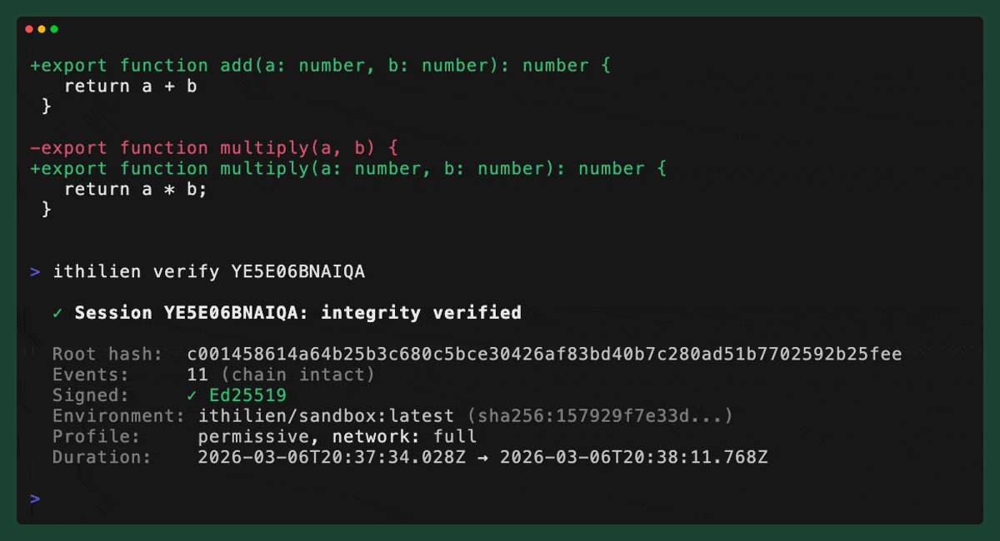

# Ithilien

Safe autonomous mode for AI coding agents.

[](https://github.com/Arjun2729/ithilien/actions/workflows/ci.yml)
[](https://www.npmjs.com/package/ithilien)
[](LICENSE)

<p align="center">
  
</p>

## Why

AI agents running autonomously can delete code, corrupt data, and leak secrets. Developers skip permissions because approval fatigue makes oversight theater. Ithilien gives agents a sandbox with real boundaries and gives you a complete, tamper-evident record of everything they did.

## Quick Start

```bash
npm install -g ithilien
ithilien init
ithilien run "claude --dangerously-skip-permissions -p 'fix all lint errors'"
ithilien show <session-id>
```

## How It Works

Ithilien wraps any terminal agent command in a Docker container with configurable guardrails — filesystem boundaries, network policies, resource limits. After the agent finishes, you review the full audit trail of file changes, commands, and network requests, then selectively apply changes back to your workspace.

| Command | Description |
|---------|-------------|
| `ithilien run <cmd>` | Run an agent command in a sandboxed Docker container |
| `ithilien log` | List recent sessions |
| `ithilien show <id>` | Show full audit trail for a session |
| `ithilien diff <id>` | Show unified diff of all file changes in a session |
| `ithilien apply <id>` | Apply changes from a session to your workspace |
| `ithilien verify <id>` | Verify integrity of a session audit trail |
| `ithilien export <id>` | Export a session as a `.ithilien-bundle` file |
| `ithilien import <file>` | Import and verify a `.ithilien-bundle` file |
| `ithilien keygen` | Generate an Ed25519 signing keypair for session signing |
| `ithilien init` | Initialize Ithilien in the current project |
| `ithilien profiles` | List available guardrail profiles |
| `ithilien approve-server` | Start the remote approval server for phone-based tool approvals |

## Features

- **Docker sandboxing** with configurable guardrail profiles (`default`, `strict`, `permissive`)
- **Filesystem boundaries** — workspace isolation, blocked paths (`~/.ssh`, `~/.aws`), protected file patterns (`.env*`, `*.pem`)
- **Network modes** — `none` (air-gapped), `allowlist` (package registries + APIs only), `full`
- **Resource limits** — CPU, memory, and session timeout
- **Complete audit trail** — file diffs, commands with output, network requests, guardrail events
- **Tamper-evident integrity** — SHA-256 hash chain over every session event
- **Optional Ed25519 signing** — `ithilien keygen` generates a keypair, sessions auto-sign
- **Portable session bundles** — export `.ithilien-bundle` ZIP files for team review or compliance
- **HTML session reports** — `ithilien show <id> --format html`
- **Remote approval server** — approve agent tool calls from your phone via QR code
- **Agent-agnostic** — works with any terminal agent

## Supported Agents

| Agent | Example Command |
|-------|----------------|
| Claude Code | `ithilien run "claude --dangerously-skip-permissions -p 'fix tests'"` |
| Codex CLI | `ithilien run "codex --full-auto 'add input validation'"` |
| Aider | `ithilien run "aider --yes-always 'refactor auth module'"` |
| Goose | `ithilien run "goose session start -a 'add error handling'"` |
| Any CLI agent | `ithilien run "<your-agent-command>"` |

## Requirements

- [Docker](https://docs.docker.com/get-docker/) (running)
- Node.js >= 20

## Configuration

Run `ithilien init` to create a `.ithilien/config.json` in your project. Choose from built-in profiles:

- **default** — Balanced safety. Allowlist networking, 4 CPUs, 8 GB memory, 1h timeout.
- **strict** — Maximum isolation. No network, 2 CPUs, 4 GB memory, 30m timeout.
- **permissive** — Minimal restrictions. Full network, 8 CPUs, 16 GB memory, 2h timeout.

Override per-run with `--profile`:

```bash
ithilien run --profile strict "claude -p 'audit dependencies'"
```

## Contributing

See [CONTRIBUTING.md](CONTRIBUTING.md) for development setup and guidelines.

## License

[MIT](LICENSE)
